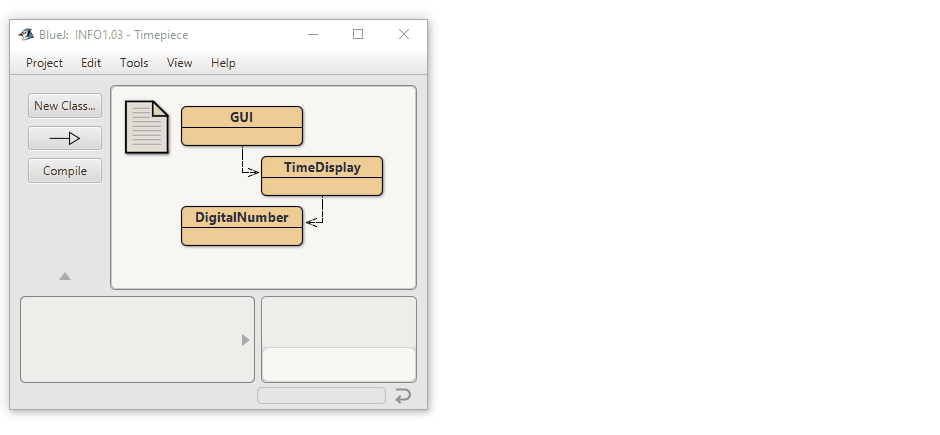
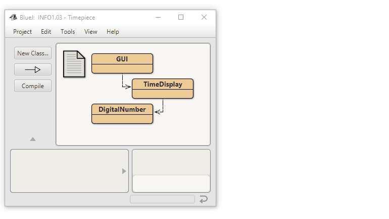

Description from the project:
The TimeDisplay class implements a digital clock display for a...

1) European-style 24 hour clock. The clock shows hours and minutes. The
range of the clock is 00:00 (midnight) to 23:59 (one minute before midnight).

or

2) US-style 12 hour clock. The clock shows hours and minutes. The range of
the clock is 01:00 (midnight) to 12:59 (one minute before midnight)
and keeps track if it's am or pm

or

3) A "fake" US-style showing 12 hour clock but is a European clock inside.

The clock display receives "ticks" (via the timeTick method) every minute
and reacts by incrementing the display. This is done in the usual clock
fashion: the hour increments when the minutes roll over to zero.

Based on the original by David J. Barnes and Michael Kölling
@author n-c0de-r
@version 2023.02.05

Includes a very basic GUI and with a sound file, could potentiall
even play an alarm sound when everything is set up correctly.

